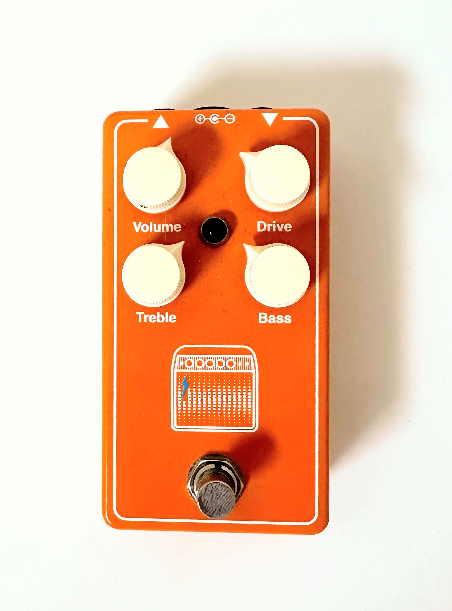

# Guitar Pedal Builds

> I enjoy building guitar effects pedals. Soldering is my Lego.

## Pedals

### Low Tide

- **Circuit Design** - PedalPCB [Low Tide Modulator](https://www.pedalpcb.com/product/pcb406/)
- **Based on** - Fairfield Circuitry Shallow Water
- **Effect Type** - Modulation / "K-Field Modulator" / Chorus / Flange
- **Description** - The circuit creates random modulation effect through a random pulse generator, a gating circuit, a low-pass filter, and a bucket-brigade delay. When you see demos only of the Fairfield pedal is sounds pretty "out there" but you can dial this pedal in to make a wide variety of great effects: low-fi, chorus, vibrator, and flanger. The randomness adds a really cool dimension and reminds me a little of the Strymon Deco Auto-Flange feature. This is one of my favorite pedals.

### Space Chorus

- **Circuit Design** - PedalPCB [Caesar Chorus](https://www.pedalpcb.com/product/pcb359/)
- **Based on** - Walrus Audio Julia
- **Effect Type** - Chorus
- **Description** - This pedal uses a bucket-brigade delay to create a pure analog chorus effect. We'll see how it sounds.

### Pink Push

- **Circuit Design** - PedalPCB [Blue Shoe Gai Pan](https://www.pedalpcb.com/product/blueshoegaipan/)
- **Based on** - JHS PG-13
- **Effect Type** - Distortion
- **Description** - Based on a pedal created by Josh Scott of JHS pedals in collaboration with Paul Gilbert, this is a monster of a distortion pedal. It's always on my pedal board and engaged most of the time. The settings in the photo give a nice boost with some color, juicy drive, and really nice volume sensitivity.

### M800

- **Circuit Design** - PedalPCB [M800 Overdrive](https://www.pedalpcb.com/product/m800/)
- **Based on** - JHS PG-13
- **Effect Type** - Overdrive
- **Description** - This is another stalwart of my pedal board. At low levels this pedal acts as a great preamp, adding color to the sound. Push it a little and you're rocking a high-gain Marshal stack.

### Space Echo

- **Circuit Design** - Build Your Own Clone [Analog Delay](https://buildyourownclone.com/products/analogdelay)
- **Based on** - BOSS DM-2
- **Effect Type** - Delay
- **Description** - This is a really simple analog delay pedal using bucket brigade delay chips. It has the standard delay, repeat, and volume controls - no modulation, no tap. But the sound is great. A fun way to use this pedal is to really saturate the levels and get some compression and drive out of it.

### Cygnus G-2

- **Circuit Design** - Aion Effects [Distortion Sustainer](https://aionfx.com/project/cygnus-distortion-sustainer/)
- **Based on** - Cornish G2
- **Effect Type** - Distortion/Fuzz
- **Description** - While I really like the sound of this pedal in concept - very Muff-like - it's too dark for my liking. When building this pedal I missed option to swap out some of the caps for a brighter sound. I plan on making this one again with the bright option.

### Sovereign

- **Circuit Design** - Aion Effects [Gaia Preamp Drive](https://aionfx.com/project/gaia-preamp-drive-mk-ii/)
- **Based on** - Catalinbread Galileo
- **Effect Type** - Preamp
- **Description** - Modeled on a treble-boosted Vox AC30 sound, notably used by Brian May of Queen. This pedal is the hook from "I want to break free."

### Ben Drive

- **Circuit Design** - PedalPCB [Son of Ben Preamp](https://www.pedalpcb.com/product/sobpreamp/)
- **Based on** - Benson Preamp
- **Effect Type** - Preamp
- **Description** - The Benson Preamp is modeled after the preamp stage of the Benson Chimera 30-watt amp. I have no idea if this clone sounds true to the original. It sounds good, I enjoy it, but it's not something I use much.

### Martian Delay

- **Circuit Design** - PedalPCB [Dark Rift Delay](https://www.pedalpcb.com/product/darkriftdelay/)
- **Based on** - Earthquaker Devices Space Spiral
- **Effect Type** - Delay
- **Description** - Based on the PT2399 Karaoke machine echo chip with some good options to play with modulation. I like the way this pedal looks more than the way it sounds. For delay, I prefer the Space Echo.

### King Ghidorah

- **Circuit Design** - PedalPCB [Pro Filter](https://www.pedalpcb.com/product/pro-filter/)
- **Based on** - Anderton Super Tone Control
- **Effect Type** - EQ
- **Description** - This pedal is a highly configurable 3-band EQ with State Variable Filter. This is another example of a pedal that I enjoy looking at more than listening to.

### Sad Octopus

- **Circuit Design** - PedalPCB [Abyss](https://www.pedalpcb.com/product/abyss/)
- **Based on** - Earthquaker Devices The Depths
- **Effect Type** - Modulation: Vibe
- **Description** - Optical vibe using LDRs. The sad part is my paint job. I don't know that I paired the LDRs with the LEDs very well. The vibe sounds a little funky, like it's wrapping around a 32-bit overflow. I need a better vibe.

### Ghost in the Machine

- **Circuit Design** - PedalPCB [Spirit Box](https://www.pedalpcb.com/product/spiritbox/)
- **Based on** - Earthquaker Devices Ghost Echo
- **Effect Type** - Delay + Reverb
- **Description** - Uses a PT2399 delay chip + Belton box reverb to create pretty cool echoey reverb. I took some liberties with the labels on the controls - they control the depth of reverb and the length and amount of delay mixed in. I'd probably use this more if I didn't have the Strymon Flint on my board.

### Transmission

- **Circuit Design** - PedalPCB [Simulcast](https://www.pedalpcb.com/product/pcb146/)
- **Based on** - Hudson Broadcast
- **Effect Type** - Overdrive/Distortion
- **Description** - One of the first pedals I made, this is a transformer-coupled germanium preamp design. It has a nice crunchy sound.

### Super Heterodyne Receiver

- **Circuit Design** - PedalPCB [SuperHeterodyne Receiver](https://www.pedalpcb.com/product/superheterodynereceiver/)
- **Based on** - Earthquaker Devices Data Corruptor
- **Effect Type** - Fuzz
- **Description** - This pedal takes an incoming audio signal and digitizes it using CMOS NAND chips. It then creates harmonic variants of the resulting bit stream, fiddles, merges, and then DtoA to create a pretty wild and out of control fuzz sound.

## Attribution
Some pedals contain vector art used under license (Creative Commons, Public Domain). See ATTRIBUTION.md files in pedal directories.