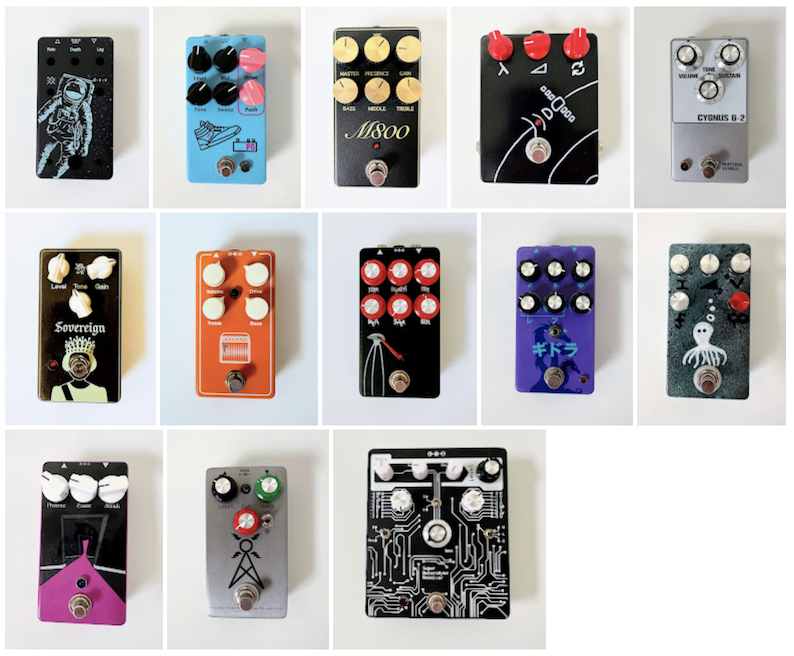

# Guitar Pedal Builds

> I enjoy building guitar effects pedals. Soldering is my Lego.

## Pedals

### Space Chorus *(Work in progress)*

- **Circuit Design** - PedalPCB [Caesar Chorus](https://www.pedalpcb.com/product/pcb359/)
- **Based on** - Walrus Audio Julia
- **Effect Type** - Chorus

### Pink Push

- **Circuit Design** - PedalPCB [Blue Shoe Gai Pan](https://www.pedalpcb.com/product/blueshoegaipan/)
- **Based on** - JHS PG-13
- **Effect Type** - Distortion

### M800

- **Circuit Design** - PedalPCB [M800 Overdrive](https://www.pedalpcb.com/product/m800/)
- **Based on** - JHS PG-13
- **Effect Type** - Overdrive

### Space Echo

- **Circuit Design** - Build Your Own Clone [Analog Delay](https://buildyourownclone.com/products/analogdelay)
- **Based on** - BOSS DM-2
- **Effect Type** - Delay

### Cygnus G-2

- **Circuit Design** - Aion Effects [Distortion Sustainer](https://aionfx.com/project/cygnus-distortion-sustainer/)
- **Based on** - Cornish G2
- **Effect Type** - Distortion/Fuzz

### Sovereign

- **Circuit Design** - Aion Effects [Gaia Preamp Drive](https://aionfx.com/project/gaia-preamp-drive-mk-ii/)
- **Based on** - Catalinbread Galileo
- **Effect Type** - Preamp
- **Description** - Modeled on a treble-boosted Vox AC30 sound, notably used by Brian May of Queen

### Ben Drive

- **Circuit Design** - PedalPCB [Son of Ben Preamp](https://www.pedalpcb.com/product/sobpreamp/)
- **Based on** - Benson Preamp
- **Effect Type** - Preamp
- **Description** -

### Martian Delay

- **Circuit Design** - PedalPCB [Dark Rift Delay](https://www.pedalpcb.com/product/darkriftdelay/)
- **Based on** - Earthquaker Devices Space Spiral
- **Effect Type** - Delay
- **Description** - Based on the PT2399 Karaoke machine echo chip

### King Ghidorah

- **Circuit Design** - PedalPCB [Pro Filter](https://www.pedalpcb.com/product/pro-filter/)
- **Based on** - Anderton Super Tone Control
- **Effect Type** - EQ
- **Description** - 3-band EQ with State Variable Filter

### Sad Octopus

- **Circuit Design** - PedalPCB [Abyss](https://www.pedalpcb.com/product/abyss/)
- **Based on** - Earthquaker Devices The Depths
- **Effect Type** - Modulation: Vibe
- **Description** - Optical vibe using LDRs. The sad part is my paint job

### Ghost in the Machine

- **Circuit Design** - PedalPCB [Spirit Box](https://www.pedalpcb.com/product/spiritbox/)
- **Based on** - Earthquaker Devices Ghost Echo
- **Effect Type** - Delay + Reverb
- **Description** - Uses a PT2399 delay chip + Belton box reverb to create pretty cool echoey reverb

### Transmission

- **Circuit Design** - PedalPCB [Simulcast](https://www.pedalpcb.com/product/pcb146/)
- **Based on** - Hudson Broadcast
- **Effect Type** - Overdrive/Distortion
- **Description** - Transformer-coupled germanium preamp design

### Super Heterodyne Receiver

- **Circuit Design** - PedalPCB [SuperHeterodyne Receiver](https://www.pedalpcb.com/product/superheterodynereceiver/)
- **Based on** - Earthquaker Devices Data Corruptor
- **Effect Type** - Fuzz
- **Description** - This pedal takes an incoming audio signal and digitizes it using CMOS NAND chips. It then creates harmonic variants of the resulting bit stream, fiddles, merges, and then DtoA to create a pretty wild and out of control fuzz sound.

